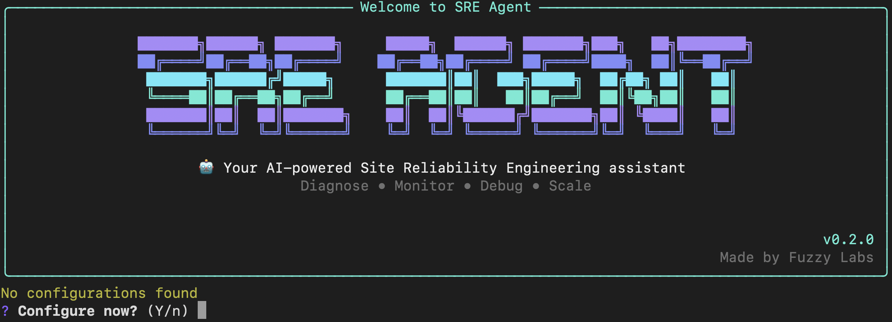
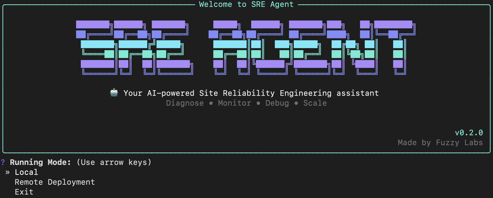
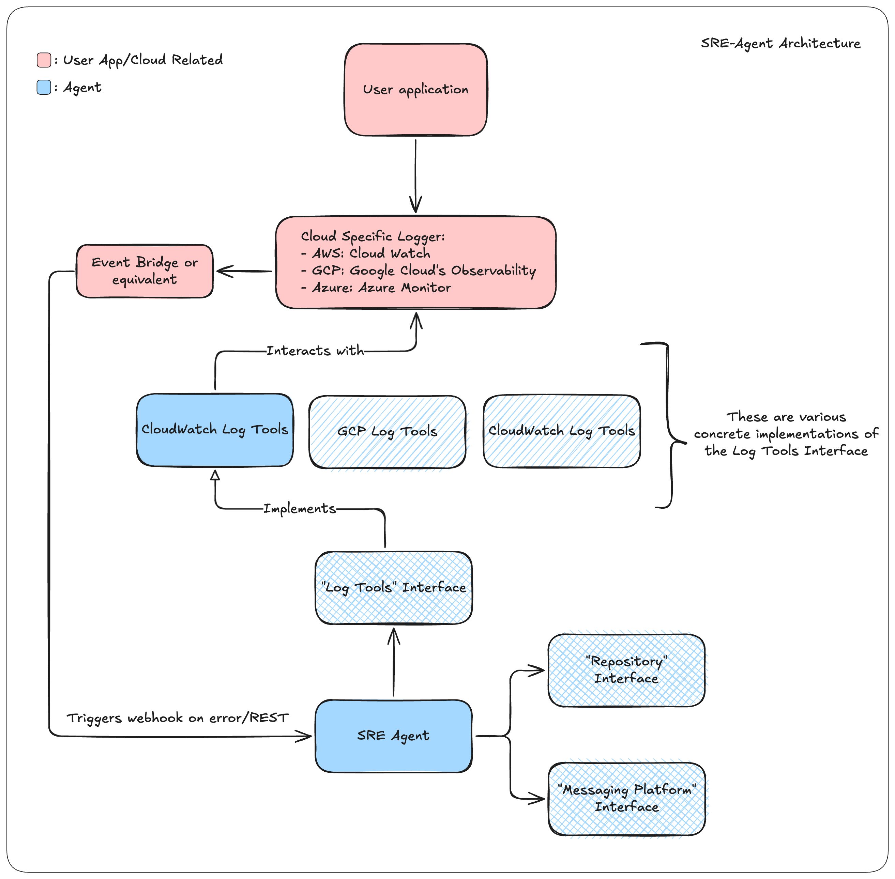
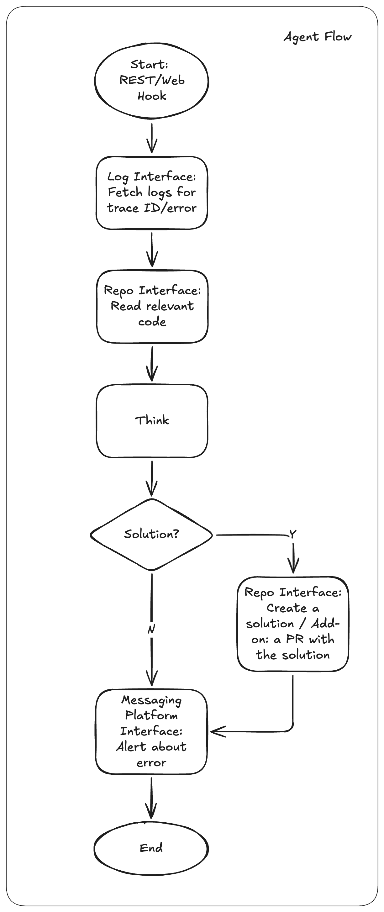

<h1 align="center"> <!-- spellchecker:disable-line -->
    🚀 Site Reliability Engineer (SRE) Agent 🕵️‍♀️
</h1>

Welcome to the SRE Agent project. This open-source AI agent helps you monitor logs, diagnose production issues, suggest fixes, and post findings to your team so you can move faster when things go wrong.

<p align="center"> <!-- spellchecker:disable-line -->
  
</p>

# 🏃 Quick Start

## Prerequisites

- Python 3.13+
- [Docker](https://docs.docker.com/get-docker/) (required for local mode)

## 1️⃣ Install the SRE Agent
```bash
pip install sre-agent
```

## 2️⃣ Start the CLI
```bash
sre-agent
```

On first run, the setup wizard will guide you through configuration:



## 3️⃣ Provide the required setup values

The wizard currently asks for:

- `ANTHROPIC_API_KEY`
- `GITHUB_PERSONAL_ACCESS_TOKEN`
- `GITHUB_OWNER`, `GITHUB_REPO`, `GITHUB_REF`
- `SLACK_BOT_TOKEN`, `SLACK_CHANNEL_ID`
- AWS credentials (`AWS_PROFILE` or access keys) and `AWS_REGION`

By default the agent uses `claude-sonnet-4-5-20250929`. You can override this by setting the `MODEL` environment variable.

## 4️⃣ Pick a running mode

After setup, the CLI gives you two modes:

- `Local`: run diagnoses from your machine against a CloudWatch log group.
- `Remote Deployment`: deploy and run the agent on AWS ECS.

Remote mode currently supports AWS ECS only for deploying the agent runtime.

This is the local shell view:



# 🌟 What Does It Do?

Think about a microservice app where any service can fail at any time. The agent watches error logs, identifies which service is affected, checks the configured GitHub repository, diagnoses likely root causes, suggests fixes, and reports back to Slack.

In short, it handles the heavy lifting so your team can focus on fixing the issue quickly.

Your application can run on Kubernetes, ECS, VMs, or elsewhere. The key requirement is that logs are available in CloudWatch.

# 🗺️ Integration Roadmap

#### 🧠 Model provider

- [x] Anthropic
- [ ] vLLM
- [ ] OpenAI

#### 🪵 Logging platform

- [x] AWS CloudWatch
- [ ] Google Cloud Observability
- [ ] Azure Monitor

#### 🏢 Remote code repository

- [x] GitHub
- [ ] GitLab
- [ ] Bitbucket

#### 🔔 Notification channel

- [x] Slack
- [ ] Microsoft Teams

#### 🕶️ Remote deployment mode:

- [x] AWS ECS

> [!TIP]
> Looking for a feature or integration that is not listed yet? Open a [Feature / Integration request](https://github.com/fuzzylabs/sre-agent/issues/new?template=feature_or_integration_request.yml) 🚀

# 🏛️ Architecture



The diagram shows the boundary between your application environment and the agent responsibilities.

You are responsible for getting logs into your logging platform and setting up how the agent is triggered (for example, CloudWatch metric filters and alarms). Once triggered, the agent handles diagnosis and reporting.

The monitored application is not limited to AWS ECS. It can be deployed anywhere, as long as it sends relevant logs to CloudWatch.

When running with the current stack, the flow is:

1. Read error logs from CloudWatch.
2. Inspect source code via the configured GitHub MCP integration.
3. Produce diagnosis and fix suggestions.
4. Send results to Slack.



# 🧪 Evaluation

We built an evaluation suite to test both tool-use behaviour and diagnosis quality. You can find details here:

- [Evaluation overview](src/sre_agent/eval/README.md)
- [Tool call evaluation](src/sre_agent/eval/tool_call/README.md)
- [Diagnosis quality evaluation](src/sre_agent/eval/diagnosis_quality/README.md)

Run the suites with:

```bash
uv run sre-agent-run-tool-call-eval
uv run sre-agent-run-diagnosis-quality-eval
```

# 🤔 Why We Built This

We wanted to learn practical best practices for running AI agents in production: cost, safety, observability, and evaluation. We are sharing the journey in the open and publishing what we learn as we go.

We also write about this work on the [Fuzzy Labs blog](https://www.fuzzylabs.ai/blog).

> **Contributions welcome.** [Join us](CONTRIBUTING.md) and help shape the future of AI-powered SRE.

# 🔧 For Developers

See [DEVELOPMENT.md](DEVELOPMENT.md) for the full local setup guide.

Install dependencies:

```bash
uv sync --dev
```

Run the interactive CLI locally:

```bash
uv run sre-agent
```

If you want to run a direct diagnosis without the CLI:

```bash
docker compose up -d slack
uv run python -m sre_agent.run /aws/containerinsights/no-loafers-for-you/application currencyservice 10
```
