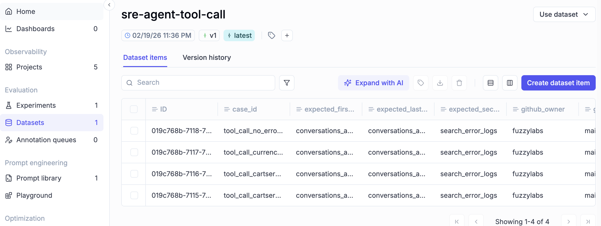
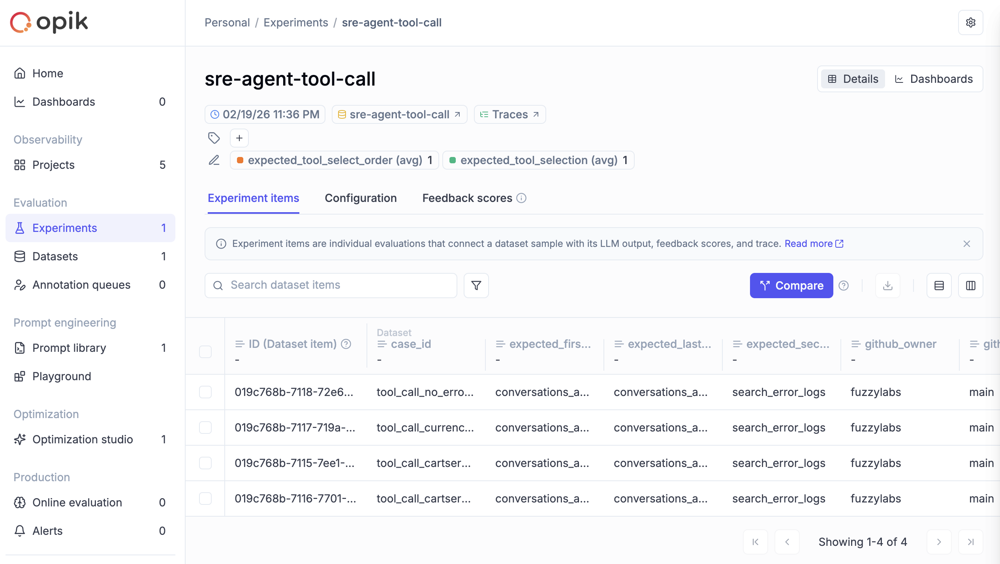

# Tool Call Evaluation

This suite checks whether the agent uses the right tools in the right order.

## What it evaluates

This focuses on tool selection behaviour, not diagnosis quality.

The metrics are:

- `expected_tool_select_order`: validates first, second, and last tool call order, with optional GitHub steps in the middle.
- `expected_tool_selection`: validates required tool usage coverage, and conditionally validates GitHub tool usage when GitHub tools are expected.

Both metrics use Opik `task_span` data and inspect spans with `type="tool"`.

## Execution model

The run is hybrid:

- GitHub MCP calls are real.
- Slack and CloudWatch tools are mocked.
- Tool usage is extracted from spans, not from model message parsing.

## Dataset shape

Test cases are loaded from:

- `src/sre_agent/eval/tool_call/dataset/test_cases`

Each case follows `ToolCallEvalCase` in:

- `src/sre_agent/eval/tool_call/dataset/schema.py`

Key fields:

- `case_id`
- `service_name`
- `github_owner`, `github_repo`, `github_ref`
- `mock_cloudwatch_entries`
- `expected_first_tool`, `expected_second_tool`, `expected_last_tool`
- `possible_github_tools`

Notes:

- Opik injects its own dataset row `id`, which is not the same as `case_id`.
- For a "no error logs found" scenario, use `mock_cloudwatch_entries: []`.

## Run

Required environment:

- `ANTHROPIC_API_KEY`
- `GITHUB_PERSONAL_ACCESS_TOKEN`

If you are running Opik locally, start the Opik platform first:

```bash
# Clone the Opik repository
git clone https://github.com/comet-ml/opik.git

# Navigate to the repository
cd opik

# Start the Opik platform
./opik.sh
```

See [comet-ml/opik](https://github.com/comet-ml/opik) for details.

When the server is running, open [http://localhost:5173/](http://localhost:5173/) to view datasets and experiments.

Run command:

```bash
uv sync --group eval
uv run sre-agent-run-tool-call-eval
```

## View Results in Opik

Dataset view:



Experiment view:


